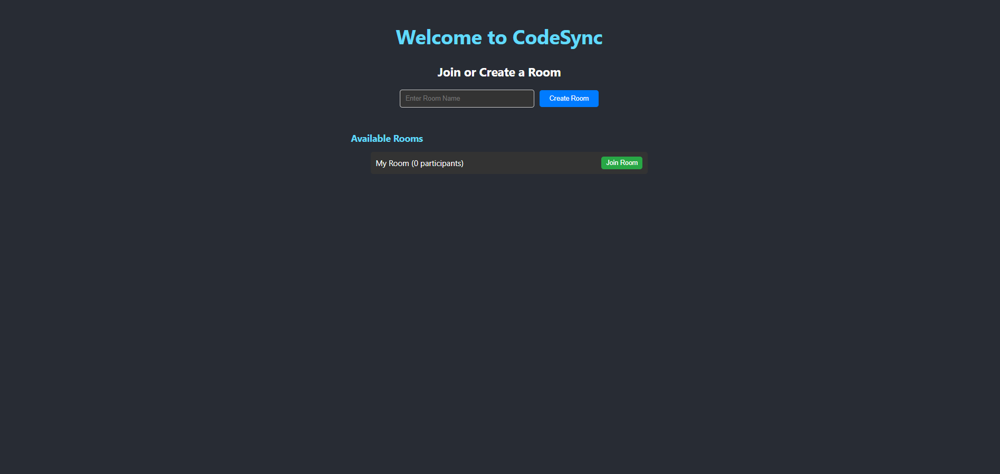
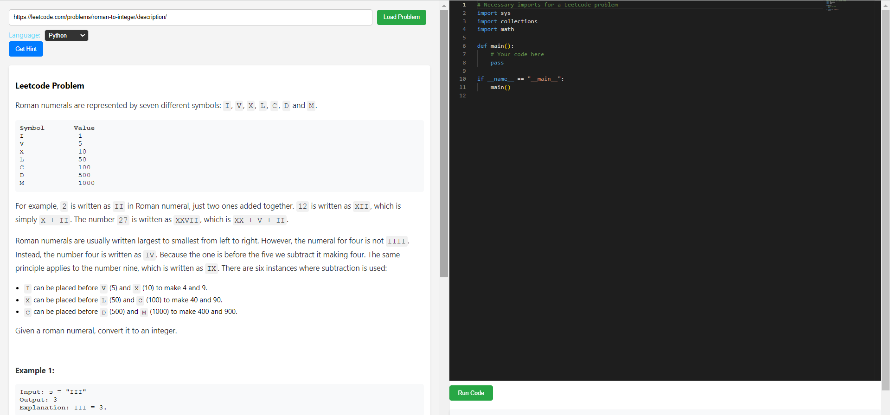

# CodeSync

CodeSync is a real-time collaborative coding platform that enables users to fetch and solve LeetCode problems together in shared rooms. The platform integrates AI-driven hints powered by OpenAI to assist users in solving coding challenges more effectively.

## Features

- **Real-time Collaboration:** Work together with others on coding problems in real-time.
- **LeetCode Integration:** Fetch LeetCode problems directly into the platform and start solving them immediately.
- **AI-Powered Hints:** Get context-aware coding hints based on the current problem and your code using the OpenAI API.
- **Room Timeout Logic:** Rooms automatically close when inactive, optimizing server resources.

## Screenshots

### Lobby Interface


### Room for Pairwise-Programming


## Installation

1. Clone the repository:
    ```bash
    git clone https://github.com/your-username/codesync.git
    ```
2. Navigate to the backend directory and install dependencies:
    ```bash
    cd backend
    npm install
    ```
3. Start the backend server:
    ```bash
    npm start
    ```
4. In another terminal, navigate to the frontend directory and install dependencies:
    ```bash
    cd ../frontend
    npm install
    ```
5. Start the frontend development server:
    ```bash
    npm start
    ```

## Usage

- Visit `http://localhost:3000` in your browser to start using the application.
- Create a room or join an existing one to collaborate on coding problems.
- Fetch LeetCode problems by entering their URLs, and use the AI-powered hint system to get assistance.

## Technologies Used

- **Frontend:** React, Socket.io, Auth0 for authentication
- **Backend:** Node.js, Express, Apollo Server, Socket.io
- **APIs:** LeetCode API, OpenAI API
- **Deployment:** Render